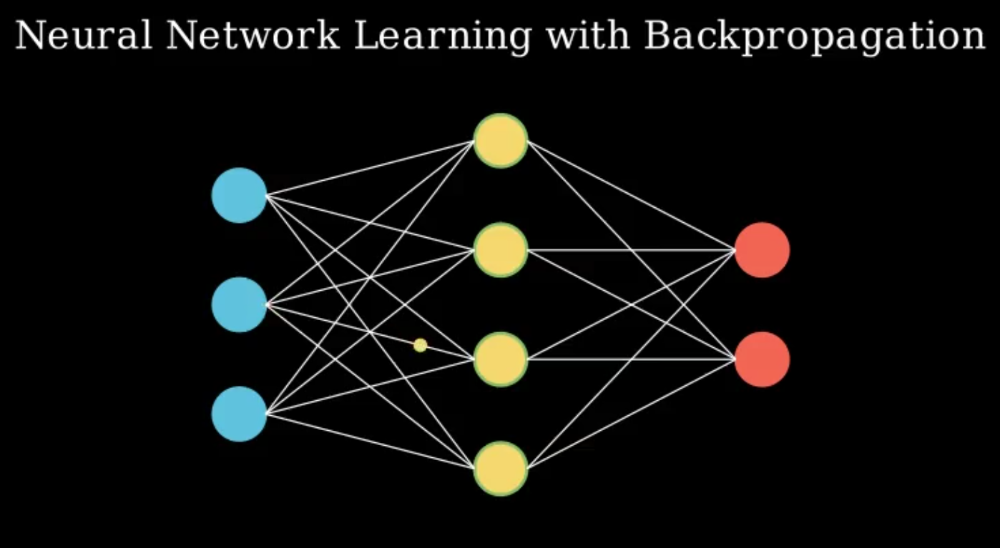
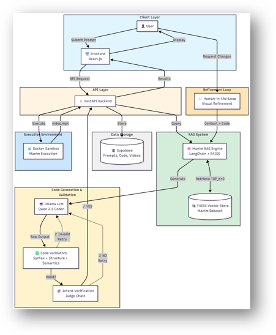
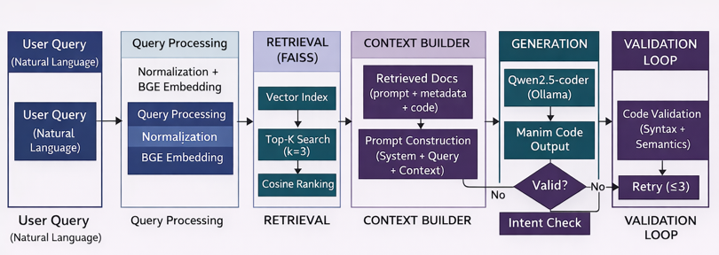
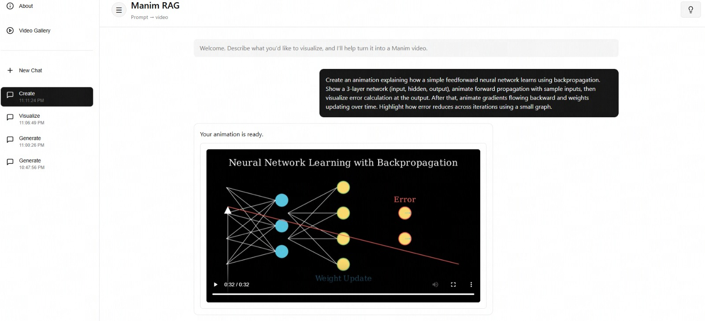

# MLViz – Automated Math & ML Visualization using AI

## Overview


MLViz is an AI-based system that converts natural language prompts into executable Manim animations for Mathematics, Machine Learning, and Deep Learning concepts.

Users can describe a concept such as "backpropagation in a neural network", and the system automatically generates, validates, and renders a complete animation video.

The system uses a Retrieval-Augmented Generation (RAG) pipeline to improve accuracy by grounding the language model with relevant Manim examples before code generation.

---

## System Architecture


The architecture consists of:

- Frontend (React) for user interaction  
- FastAPI backend for orchestration  
- RAG system using FAISS for retrieval  
- LLM (Qwen 2.5 Coder 7B) for code generation  
- Validation layer for correctness checks  
- Docker sandbox for secure execution  
- Manim engine for rendering animations  
- Database (Supabase) for storing prompts, code, and outputs  

---

## RAG Pipeline Flow


Pipeline steps:

1. User prompt is processed and embedded  
2. FAISS retrieves top-k similar examples  
3. Context is constructed using retrieved examples  
4. LLM generates Manim code  
5. Code is validated (syntax + semantics)  
6. Retry loop triggers if validation fails  
7. Valid code is passed for execution  

---

## UI and Output


The interface allows users to:

- Enter natural language prompts  
- View generated animations  
- Refine outputs iteratively  
- Access previous generations  

---

## Setup and Installation

### Clone Repository
```bash
git clone https://github.com/your-repo/mlviz.git
cd mlviz
````

---

## Backend Setup

```bash
pip install -r requirements.txt
uvicorn backend.main:app --reload --port 8005
```

---

## Frontend Setup

```bash
cd frontend
npm install
npm run dev
```

---

## Docker Sandbox

Prebuilt image:
[https://hub.docker.com/r/sahajbhatt/manim-sandbox](https://hub.docker.com/r/sahajbhatt/manim-sandbox)

### Pull Image

```bash
docker pull sahajbhatt/manim-sandbox
```

### Run Container

```bash
docker run --rm sahajbhatt/manim-sandbox
```

This container securely executes AI-generated Manim code.

---

## LLM Setup (Qwen 2.5 Coder 7B)

### Install Ollama

```bash
curl -fsSL https://ollama.com/install.sh | sh
```

### Pull Model

```bash
ollama pull qwen2.5-coder:7b
```

### Run Model

```bash
ollama run qwen2.5-coder:7b
```

Ensure backend is configured to use this model.

---

## How It Works

```text
User Prompt
   ↓
Query Processing
   ↓
FAISS Retrieval
   ↓
Context Building
   ↓
LLM Code Generation
   ↓
Validation Loop
   ↓
Docker Sandbox Execution
   ↓
Manim Rendering
   ↓
Final Animation Output
```

## Advantages

* Eliminates manual Manim coding
* Improves conceptual understanding
* Uses RAG for higher accuracy
* Secure execution using Docker
* Scalable and modular architecture

---

## Limitations

* Depends on prompt clarity
* Limited to Manim-supported visualizations
* Complex outputs may require refinement
* Occasional retries due to validation

---

## Team

* Sahaj Bhattacharjee
* Sagar S
* Sartaaj Sandhu
* Shreekar B R

Guide: Dr. Madhusudhan H S
